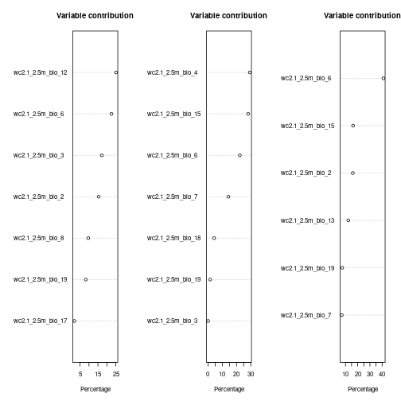
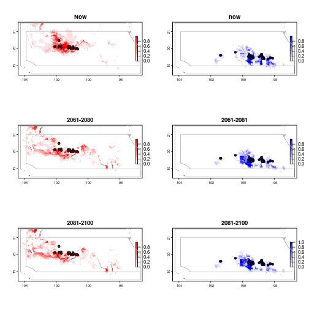

```r
library(tidyverse)
```

Read data and combine bioclimatic variables with observations


```r
Dat <- read_csv("data/teosintle_maxent_input.csv")
```

```
## Rows: 604 Columns: 3
## ── Column specification ─────────────────────────────────────────────────────────────────────────────────────────────────────────────
## Delimiter: ","
## chr (1): ID
## dbl (2): lon, lat
## 
## ℹ Use `spec()` to retrieve the full column specification for this data.
## ℹ Specify the column types or set `show_col_types = FALSE` to quiet this message.
```

```r
bioclim <- terra::rast("data/teosintle_bioclim_raster.tif")
```

Run maxent

Performs variable selection and then runs maxent on presence only data

@param Dat A data.frame or tibble with one row per presence
observation
@param bioclim A "SpatRaster" object. Should be already cropped to quadran
of interest
@param lon_lat A character vector with the names of the columns in Dat
corresponding to longitude and latitude. I that order. 

@return A MaEnt model
@export

@examples


```r
model_maxent <- function(Dat, bioclim,
                         lon_lat = c("lon", "lat"),
                         cor_thres = 0.7){
  
  # Remove colinear variables, use Variance Inflation Factor.
  selected_vars <- fuzzySim::corSelect(data = terra::extract(x = bioclim,
                                                            y = Dat %>%
                                                              select(lon, lat),
                                                            ID = FALSE),
                      var.cols = names(bioclim),
                      coeff = TRUE,
                      cor.thresh = cor_thres,
                      select = "VIF",
                      method = "pearson")
  bioclim <- bioclim[[selected_vars$selected.vars]]
  
  
  me <- dismo::maxent(x = as(bioclim, "Raster"),
                      p = Dat %>%
                        select(all_of(lon_lat)) %>%
                        as.data.frame(),
                      nbg = 1e4)
  
  return(me)
}
```

Run models on each group and combined


```r
me_g1 <- model_maxent(Dat = Dat %>%
                        filter(ID == "g1"),
                      bioclim = bioclim,
                      lon_lat = c("lon", "lat"),
                      cor_thres = 0.7)
```

```
## Using VIF as the 'select' criterion.
```

```
## 12 variable(s) excluded, 7 selected
```

```r
me_g2 <-  model_maxent(Dat = Dat %>%
                         filter(ID == "g2"),
                       bioclim = bioclim,
                       lon_lat = c("lon", "lat"),
                       cor_thres = 0.7)
```

```
## Using VIF as the 'select' criterion.
## 12 variable(s) excluded, 7 selected
```

```r
me_all <-  model_maxent(Dat = Dat %>%
                          filter(ID == "all"),
                        bioclim = bioclim,
                        lon_lat = c("lon", "lat"),
                        cor_thres = 0.7)
```

```
## Using VIF as the 'select' criterion.
```

```
## 13 variable(s) excluded, 6 selected
```

```r
op <- par(mfrow = c(1, 3))
dismo::plot(me_g1)
dismo::plot(me_g2)
dismo::plot(me_all)
```



```r
par(op)

g1_pred <- terra::predict(as(bioclim, "Raster"), me_g1)
g2_pred <- terra::predict(as(bioclim, "Raster"), me_g2)
```

Forecast into the future


```r
bioclim6180 <- terra::rast("data/teosintle_forecast_2061-2080_raster.tif")
bioclim81100 <- terra::rast("data/teosintle_forecast_2081-2100_raster.tif")

g1_forecast_6180 <- terra::predict(as(bioclim6180, "Raster"), me_g1)
g1_forecast_81100 <- terra::predict(as(bioclim81100, "Raster"), me_g1)


g2_forecast_6180 <- terra::predict(as(bioclim6180, "Raster"), me_g2)
g2_forecast_81100 <- terra::predict(as(bioclim81100, "Raster"), me_g2)
```

Read map and plot


```r
quadrant_map <- terra::vect("data/teosintle_map/")


op <- par(mfrow=c(3,2))
terra::plot(quadrant_map, col = "white", main = "Now")
terra::plot(g1_pred, add = TRUE, col = colorRampPalette(c("white", "red"))(10))
points(Dat %>% filter(ID == "g1") %>% select(lon, lat), pch = 21, bg = "darkred", col = "black")
terra::plot(quadrant_map, add=TRUE, border='dark grey')

terra::plot(quadrant_map, col = "white", main = "now")
terra::plot(g2_pred, add = TRUE, col = colorRampPalette(c("white", "blue"))(10))
points(Dat %>% filter(ID == "g2") %>% select(lon, lat), pch = 21, bg = "darkblue", col = "black")
terra::plot(quadrant_map, add=TRUE, border='dark grey')


terra::plot(quadrant_map, col = "white", main = "2061-2080")
terra::plot(g1_forecast_6180, add = TRUE, col = colorRampPalette(c("white", "red"))(10))
points(Dat %>% filter(ID == "g1") %>% select(lon, lat), pch = 21, bg = "darkred", col = "black")
terra::plot(quadrant_map, add=TRUE, border='dark grey')

terra::plot(quadrant_map, col = "white", main = "2061-2081")
terra::plot(g2_forecast_6180, add = TRUE, col = colorRampPalette(c("white", "blue"))(10))
points(Dat %>% filter(ID == "g2") %>% select(lon, lat), pch = 21, bg = "darkblue", col = "black")
terra::plot(quadrant_map, add=TRUE, border='dark grey')


terra::plot(quadrant_map, col = "white", main = "2081-2100")
terra::plot(g1_forecast_81100, add = TRUE, col = colorRampPalette(c("white", "red"))(10))
points(Dat %>% filter(ID == "g1") %>% select(lon, lat), pch = 21, bg = "darkred", col = "black")
terra::plot(quadrant_map, add=TRUE, border='dark grey')

terra::plot(quadrant_map, col = "white", main = "2081-2100")
terra::plot(g2_forecast_81100, add = TRUE, col = colorRampPalette(c("white", "blue"))(10))
points(Dat %>% filter(ID == "g2") %>% select(lon, lat), pch = 21, bg = "darkblue", col = "black")
terra::plot(quadrant_map, add=TRUE, border='dark grey')
```



```r
par(op)
```

For more systematic evaluation of the models
Takes a while to run


```r
# eval <- ENMeval::ENMevaluate(occs = Dat %>% filter(ID == "g1") %>% select(lon, lat) %>% as.data.frame(),
#                      envs = as(bioclim , "Raster"),
#                      tune.args = list(rm = c(0.5, 1 , 1.5),
#                                       fc = unlist(sapply(1:5, function(x) apply(combn(c("L","Q","H","P","T"), x), 2, function(y) paste(y, collapse = ""))))),
#                      bg.coords = NULL,
#                      clamp=FALSE,
#             algorithm = "maxnet",
#             method = 'jackknife',
#             parallel = TRUE,
#             numCores = 8)
```

