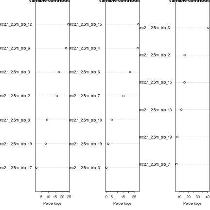
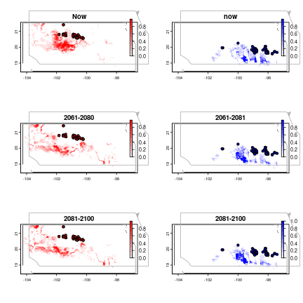

This report was automatically generated with the R package **knitr**
(version 1.41).


```r
library(tidyverse)
```

```
## ── Attaching packages ──────────────────────────────────────────────────────────────────────────────────────────── tidyverse 1.3.2 ──
## ✔ ggplot2 3.4.0      ✔ purrr   1.0.1 
## ✔ tibble  3.1.8      ✔ dplyr   1.0.10
## ✔ tidyr   1.3.0      ✔ stringr 1.5.0 
## ✔ readr   2.1.3      ✔ forcats 0.5.2 
## ── Conflicts ─────────────────────────────────────────────────────────────────────────────────────────────── tidyverse_conflicts() ──
## ✖ dplyr::filter() masks stats::filter()
## ✖ dplyr::lag()    masks stats::lag()
```

```r
#' Read data and combine bioclimatic variables with observations
Dat <- read_csv("data/teosintle_maxent_input.csv")
```

```
## Rows: 604 Columns: 3
## ── Column specification ─────────────────────────────────────────────────────────────────────────────────────────────────────────────
## Delimiter: ","
## chr (1): ID
## dbl (2): lon, lat
## 
## ℹ Use `spec()` to retrieve the full column specification for this data.
## ℹ Specify the column types or set `show_col_types = FALSE` to quiet this message.
```

```r
bioclim <- terra::rast("data/teosintle_bioclim_raster.tif")


#' Run maxent
#' 
#' Performs variable selection and then runs maxent on presence only data
#'
#' @param Dat A data.frame or tibble with one row per presence
#' observation
#' @param bioclim A "SpatRaster" object. Should be already cropped to quadran
#' of interest
#' @param lon_lat A character vector with the names of the columns in Dat
#' corresponding to longitude and latitude. I that order. 
#'
#' @return A MaEnt model
#' @export
#'
#' @examples
model_maxent <- function(Dat, bioclim,
                         lon_lat = c("lon", "lat"),
                         cor_thres = 0.7){
  
  # Remove colinear variables, use Variance Inflation Factor.
  selected_vars <- fuzzySim::corSelect(data = terra::extract(x = bioclim,
                                                            y = Dat %>%
                                                              select(lon, lat),
                                                            ID = FALSE),
                      var.cols = names(bioclim),
                      coeff = TRUE,
                      cor.thresh = cor_thres,
                      select = "VIF",
                      method = "pearson")
  bioclim <- bioclim[[selected_vars$selected.vars]]
  
  
  me <- dismo::maxent(x = as(bioclim, "Raster"),
                      p = Dat %>%
                        select(all_of(lon_lat)) %>%
                        as.data.frame(),
                      nbg = 1e4)
  
  return(me)
}


#' Run models on each group and combined
me_g1 <- model_maxent(Dat = Dat %>%
                        filter(ID == "g1"),
                      bioclim = bioclim,
                      lon_lat = c("lon", "lat"),
                      cor_thres = 0.7)
```

```
## Using VIF as the 'select' criterion.
## 12 variable(s) excluded, 7 selected
## Loading required namespace: rJava
```

```r
me_g2 <-  model_maxent(Dat = Dat %>%
                         filter(ID == "g2"),
                       bioclim = bioclim,
                       lon_lat = c("lon", "lat"),
                       cor_thres = 0.7)
```

```
## Using VIF as the 'select' criterion.
## 12 variable(s) excluded, 7 selected
```

```r
me_all <-  model_maxent(Dat = Dat %>%
                          filter(ID == "all"),
                        bioclim = bioclim,
                        lon_lat = c("lon", "lat"),
                        cor_thres = 0.7)
```

```
## Using VIF as the 'select' criterion.
## 13 variable(s) excluded, 6 selected
```

```r
op <- par(mfrow = c(1, 3))
dismo::plot(me_g1)
dismo::plot(me_g2)
dismo::plot(me_all)
```



```r
par(op)

g1_pred <- terra::predict(as(bioclim, "Raster"), me_g1)
g2_pred <- terra::predict(as(bioclim, "Raster"), me_g2)

#' Forecast into the future
bioclim6180 <- terra::rast("data/teosintle_forecast_2061-2080_raster.tif")
bioclim81100 <- terra::rast("data/teosintle_forecast_2081-2100_raster.tif")

g1_forecast_6180 <- terra::predict(as(bioclim6180, "Raster"), me_g1)
g1_forecast_81100 <- terra::predict(as(bioclim81100, "Raster"), me_g1)


g2_forecast_6180 <- terra::predict(as(bioclim6180, "Raster"), me_g2)
g2_forecast_81100 <- terra::predict(as(bioclim81100, "Raster"), me_g2)

#' Read map and plot
quadrant_map <- terra::vect("data/teosintle_map/")


op <- par(mfrow=c(3,2))
terra::plot(quadrant_map, col = "white", main = "Now")
terra::plot(g1_pred, add = TRUE, col = colorRampPalette(c("white", "red"))(10))
points(Dat %>% filter(ID == "g1") %>% select(lon, lat), pch = 21, bg = "darkred", col = "black")
terra::plot(quadrant_map, add=TRUE, border='dark grey')

terra::plot(quadrant_map, col = "white", main = "now")
terra::plot(g2_pred, add = TRUE, col = colorRampPalette(c("white", "blue"))(10))
points(Dat %>% filter(ID == "g2") %>% select(lon, lat), pch = 21, bg = "darkblue", col = "black")
terra::plot(quadrant_map, add=TRUE, border='dark grey')


terra::plot(quadrant_map, col = "white", main = "2061-2080")
terra::plot(g1_forecast_6180, add = TRUE, col = colorRampPalette(c("white", "red"))(10))
points(Dat %>% filter(ID == "g1") %>% select(lon, lat), pch = 21, bg = "darkred", col = "black")
terra::plot(quadrant_map, add=TRUE, border='dark grey')

terra::plot(quadrant_map, col = "white", main = "2061-2081")
terra::plot(g2_forecast_6180, add = TRUE, col = colorRampPalette(c("white", "blue"))(10))
points(Dat %>% filter(ID == "g2") %>% select(lon, lat), pch = 21, bg = "darkblue", col = "black")
terra::plot(quadrant_map, add=TRUE, border='dark grey')


terra::plot(quadrant_map, col = "white", main = "2081-2100")
terra::plot(g1_forecast_81100, add = TRUE, col = colorRampPalette(c("white", "red"))(10))
points(Dat %>% filter(ID == "g1") %>% select(lon, lat), pch = 21, bg = "darkred", col = "black")
terra::plot(quadrant_map, add=TRUE, border='dark grey')

terra::plot(quadrant_map, col = "white", main = "2081-2100")
terra::plot(g2_forecast_81100, add = TRUE, col = colorRampPalette(c("white", "blue"))(10))
points(Dat %>% filter(ID == "g2") %>% select(lon, lat), pch = 21, bg = "darkblue", col = "black")
terra::plot(quadrant_map, add=TRUE, border='dark grey')
```



```r
par(op)


#' For more systematic evaluation of the models
#' Takes a while to run
# eval <- ENMeval::ENMevaluate(occs = Dat %>% filter(ID == "g1") %>% select(lon, lat) %>% as.data.frame(),
#                      envs = as(bioclim , "Raster"),
#                      tune.args = list(rm = c(0.5, 1 , 1.5),
#                                       fc = unlist(sapply(1:5, function(x) apply(combn(c("L","Q","H","P","T"), x), 2, function(y) paste(y, collapse = ""))))),
#                      bg.coords = NULL,
#                      clamp=FALSE,
#             algorithm = "maxnet",
#             method = 'jackknife',
#             parallel = TRUE,
#             numCores = 8)
```

The R session information (including the OS info, R version and all
packages used):


```r
sessionInfo()
```

```
## R version 4.1.0 (2021-05-18)
## Platform: x86_64-pc-linux-gnu (64-bit)
## Running under: Ubuntu 20.04.6 LTS
## 
## Matrix products: default
## BLAS:   /usr/lib/x86_64-linux-gnu/blas/libblas.so.3.9.0
## LAPACK: /usr/lib/x86_64-linux-gnu/lapack/liblapack.so.3.9.0
## 
## locale:
##  [1] LC_CTYPE=es_US.UTF-8          LC_NUMERIC=C                  LC_TIME=es_MX.UTF-8           LC_COLLATE=es_US.UTF-8       
##  [5] LC_MONETARY=es_MX.UTF-8       LC_MESSAGES=es_US.UTF-8       LC_PAPER=es_MX.UTF-8          LC_NAME=es_MX.UTF-8          
##  [9] LC_ADDRESS=es_MX.UTF-8        LC_TELEPHONE=es_MX.UTF-8      LC_MEASUREMENT=es_MX.UTF-8    LC_IDENTIFICATION=es_MX.UTF-8
## 
## attached base packages:
## [1] stats     graphics  grDevices utils     datasets  methods   base     
## 
## other attached packages:
## [1] forcats_0.5.2   stringr_1.5.0   dplyr_1.0.10    purrr_1.0.1     readr_2.1.3     tidyr_1.3.0     tibble_3.1.8    ggplot2_3.4.0  
## [9] tidyverse_1.3.2
## 
## loaded via a namespace (and not attached):
##  [1] Rcpp_1.0.10         lubridate_1.9.1     lattice_0.22-5      assertthat_0.2.1    utf8_1.2.2          R6_2.5.1           
##  [7] cellranger_1.1.0    backports_1.4.1     reprex_2.0.2        evaluate_0.20       highr_0.10          httr_1.4.4         
## [13] pillar_1.8.1        rlang_1.0.6         googlesheets4_1.0.1 readxl_1.4.1        rstudioapi_0.14     raster_3.6-26      
## [19] rgdal_1.6-4         googledrive_2.0.0   bit_4.0.5           munsell_0.5.0       broom_1.0.2         compiler_4.1.0     
## [25] modelr_0.1.10       xfun_0.36           pkgconfig_2.0.3     dismo_1.3-14        tidyselect_1.2.0    codetools_0.2-18   
## [31] modEvA_3.9.3        fansi_1.0.4         crayon_1.5.2        tzdb_0.3.0          dbplyr_2.3.0        withr_2.5.0        
## [37] grid_4.1.0          fuzzySim_4.10.5     jsonlite_1.8.4      gtable_0.3.1        lifecycle_1.0.3     DBI_1.1.3          
## [43] magrittr_2.0.3      scales_1.2.1        cli_3.6.0           stringi_1.7.12      vroom_1.6.1         fs_1.6.0           
## [49] sp_1.6-0            xml2_1.3.3          ellipsis_0.3.2      generics_0.1.3      vctrs_0.5.2         tools_4.1.0        
## [55] bit64_4.0.5         glue_1.6.2          hms_1.1.2           parallel_4.1.0      timechange_0.2.0    colorspace_2.1-0   
## [61] gargle_1.2.1        terra_1.7-55        rvest_1.0.3         rJava_1.0-6         knitr_1.41          haven_2.5.1
```

```r
Sys.time()
```

```
## [1] "2023-11-08 11:20:02 CST"
```

